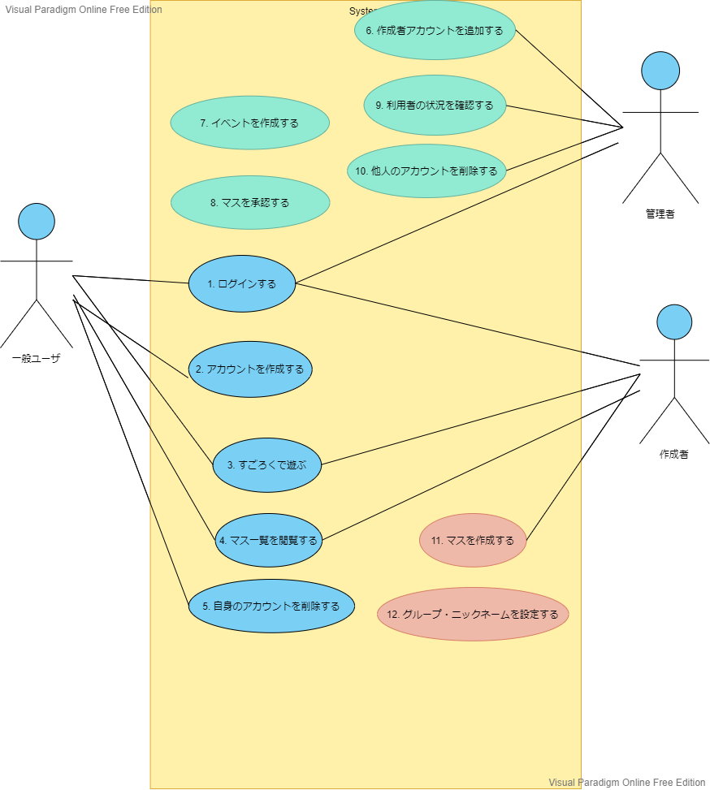

# こうみん未来塾すごろくアプリユースケース

## 1. ユースケース図

## ユースケース修正
### 2.1 一般ユーザ用ユースケース
1. [すごろくで遊ぶ](./usecase03.md)
1. [マス一覧を閲覧する](./usecase04.md)

### 2.2 管理者用ユースケース
1. [作成者アカウントを追加する](./usecase06.md)
1. [イベントを作成する](./usecase07.md)
1. [マスを承認する(イベント管理画面からスタート)](./usecase08.md)
1. [作成者アカウントを削除する](./usecase10.md)

### 2.3 マス作成者用ユースケース
1. [マスを作成する](./usecase11.md)
1. [グループ・ニックネームを編集する(トリガーを２つ用意)](./usecase12.md)

## 2. ユースケース一覧
### 2.1 一般ユーザ用ユースケース
1. [ログインする](./usecase01.md)
1. [アカウントを作成する](./usecase02.md)
1. [すごろくで遊ぶ](./usecase03.md)
1. [マス一覧を閲覧する](./usecase04.md)
1. [自身のアカウントを削除する](./usecase05.md)

### 2.2 管理者用ユースケース
1. [作成者アカウントを追加する](./usecase06.md)
1. [イベントを作成する](./usecase07.md)
1. [マスを承認する](./usecase08.md)
1. [利用者の状況を確認する](./usecase09.md)
1. [他人のアカウントを削除する](./usecase10.md)

### 2.3 マス作成者用ユースケース
1. [マスを作成する](./usecase11.md)
1. [グループ・ニックネームを設定する](./usecase12.md)
